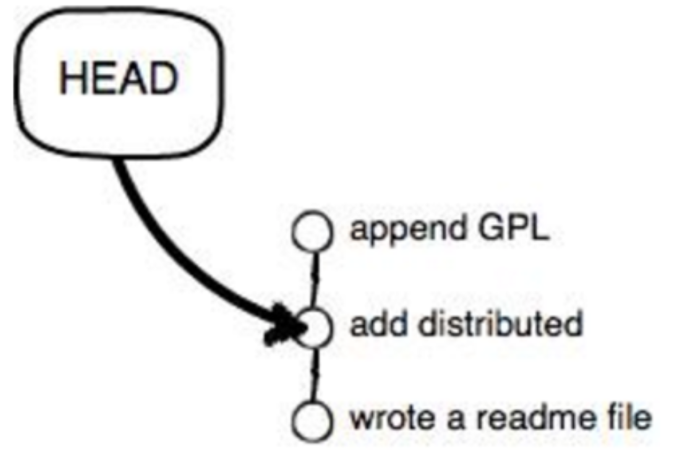
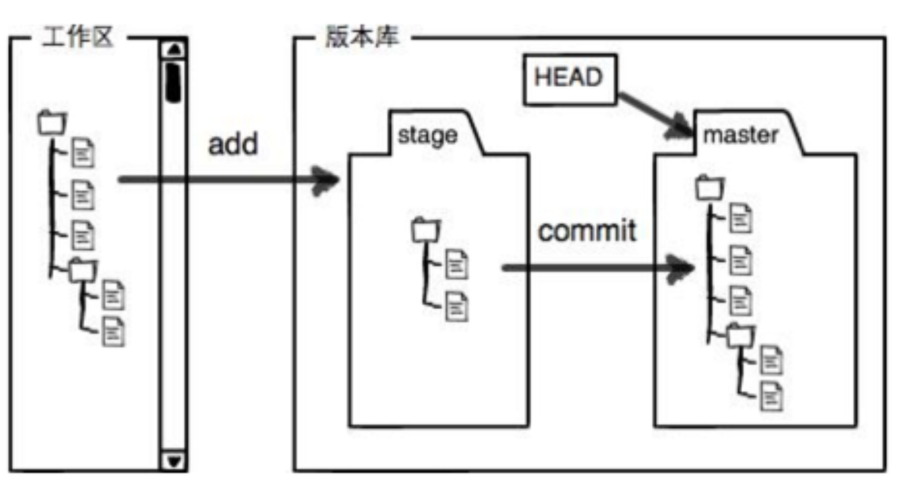

[TOC]
## 第一次安装设置
```
#因为git是分布式,这些就是你在提交commit时的签名。(--global全局设置,不加则设置当前版本库)
$ git config [--global] user.name "Your Name"
$ git config [--global] user.email "email@example.com"
```
<!--more-->
## 创建版本仓库
```
$ git init #创建版本仓库  
$ git add #添加文件到版本仓库(可同时添加多个文件空格分割)
$ git commit -m '注释内容' #提交版本  
$ git commit (-v) #提交版本,启动编辑器编写注释(-v显示详细变更信息)
$ git commit -a #提交版本,跳过使用暂存区(不用git add)
```

## 版本比对
```
$ git status (-s/--short) #查看版本库状态以及文件修改状态(显示简单信息)
1.未修改状态:nothing to commit,working tree clean
2.修改后文件已在缓存区:Changes to be commited
3.新增文件状态:Untracked files
4.修改后文件未在缓存区:Changes not staged for commit
3与4状态区别在于3无法用git commit –am命令将文件添加到本地仓库
```

> git status -s符号意义:
> ?? 新添加的未跟踪文件前面
> A 新添加到暂存区中的文件
> M 修改过的文件(出现在右边的,表示该文件被修改了但是还没放入暂存区，出现在靠左边的 M 表示该文件被修改了并放入了暂存区)

## 版本回退

> 和SVN不一样,GIT每个提交版本的commit id不是1,2,3...的数字而是一个SHA1计算出来的十六进制数字.因为GIT是分布式控制系统,如果用1,2,3...数字表示多人协作会重复.

```
HEAD #表示最新提交的版本
HEAD^ #表示上一个提交版本
HEAD~100 #表示往上100个版本(~ 代替多个 ^)
|
#git reset 版本号
$ git reset (--mixed) HEAD^ #回退到上个版本,缓存区和你指定的提交同步，但工作目录不受影响(--mixed是默认选项,可以不加)
$ git reset --soft HEAD^ #回退到上个版本,缓存区和工作区都不受影响
$ git reset --hard HEAD^ #回退到上个版本,缓存区和工作目录都同步到你指定的提交(危险指令)
```

> git reset 后面如果是版本号不用写全,只写前几位就可以了.GIT版本回退非常快,因为GIT在内部有个指向当前版本的HEAD指针,当回退版本时GIT仅仅是把HEAD从指向当前版本改为指向回退版本(如下图),顺便把工作区更新了.




> 由于git log仅显示从当前版本到历史版本的纪录,如果回退了某个版本,又想还原到最新版本怎么办呢?

```
$ git reflog 
#如果在回退以后又想再次回到之前的版本，git reflog 可以查看所有分支的所有操作记录（包括commit和reset的操作），包括已经被删除的commit记录，git log则不能察看已经删除了的commit记录
```

## 工作区和暂存区
> git和其它版本控制系统,如SVN的一个不同之处就是有暂存区的概念.
`工作区`:就是电脑能看到的仓库文件夹目录.
`版本库`:工作区内的隐藏目录.git,这个不算工作区,而是git的版本库.
GIT版本库里存了很多东西,其中最重要的就是stage(或者叫index)的暂存区,还有GIT为我们自动创建的第一个分支master,以及一个指向master的指针HEAD.
实际上git add就是把所有修改放到暂存区,git commit是把暂缓区的修改提交到分支.
**因此,修改一个文件后必须要添加(git add)到暂存区,才能提交(git commit)到分支,否则提交无效**


## 撤销修改
```
$ git commit --amend #撤消上次文件提交的修改,重新提交
$ git checkout -- 文件名 #撤销工作区文件的修改(如果没有--应变成了切换分支的命令)
$ git reset HEAD 文件名 #撤销暂存区文件修改(HEAD表示撤销到最新版本)
```

## 删除文件

```
$ git rm　[--cached] 文件名 #从版本库中删除文件(--cached从缓存区中移除到工作区)
```
> GIT删除(git rm)文件后,直接提交(git commit)即可,不需要再添加到暂存区(git add).
> 如果不小心删错了,可以直接撤销修改(git checkout -- 文件名)
> 如果文件已经提交到版本库,那么永远不用担心误删,但只能恢复到最新版本库,最新修改将丢失.

## 文件移动

```
$ git mv file_from file_to #重命名文件
实际相当于运行下面三个命令
$ mv file_from file_to
$ git rm file_from
$ git add file_to
```

## 远程仓库<a name="h2_remote_orgin"></a>
```
$ git remote add origin 远程仓库地址 #关联远程仓库(origin是git远程仓库的默认名,可以修改)
$ git push #本地内容推送到远程仓库
```
> 关联后第一次推送仓库的所有内容使用命令:git push -u origin master
> 此后,每次推送本地修改内容可以使用命令:git push origin master

```
	$ git clone [-b 分支名] 远程仓库地址 #克隆远程仓库到本地(-b指定分支)
	$ git fetch 远程仓库名 #从服务器上抓取本地没有的数据，它并不会修改工作目录中的内容, 它只会获取数据然后让你自己合并.
	$ git pull (--allow-unrelated-histories) #从服务器抓取分支数据并然后尝试合并.
```
> 由于git pull命令经常让人困惑,所以通常单独显式地使用 git fetch 与git merge 命令会更好一些。

```
$ git remote #显示远程仓库名
$ git ls-remote #显示远程引用完整列表
$ git remote show [remote-name] #查看远程仓库更多信息

$ git remote -v #显示远程仓库信息
origin  git@github.com:WindusL/LearningNotes.git (fetch)
origin  git@github.com:WindusL/LearningNotes.git (push)
```

> 上面显示了可以抓取和推送的origin地址。如果没有推送权限就看不到push的地址。

```
$ git remote rename [oldname] [newname] #对远程仓库的简写名称重命名指令
$ git remote rm [remote-name] #对远程仓库的简写名称进行移除的命令
```

## 分支管理
> Git里默认有一个主分支master，其中HEAD严格来说指向的不是提交，而是当前分支，分支才指向提交。  


> Git创建一个分支只是增加一个指针，然后将HEAD指向新的分支 ，表示在当前分支，工作区的文件没有任何变化。  

```
$ git branch 分支名 #创建分支
$ git checkout 分支名 #切换分支
#上面两个命令相当于
$ git checkout -b 分支名 #创建并切换分支(加上-b表示先创建后切换)
$ git checkout -b 分支名 远程分支名 ＃拉取远程分支到本地分支((加上-b表示先创建后切换)

$ git branch (-a/r) #列出所有本地分支(-a 包括远程分支,-r仅列出远程分支)
$ git branch -v|-vv #查看每个分支最后一次的提交(-vv选项会列表更多信息)
$ git merge 分支名 #合并指定分支到当前分支
$ git branch -d (-r) 分支名 #删除已合并本地分支(加-r表示删除romote远程分支)
$ git branch -D 分支名 #强制删除未合并的分支
$ git branch -m|-M 旧分支名 新分支名 # 分支生命名（-M强制生命名）
```

> 重命名远程分支推荐做法:
> 1、删除远程分支
> 2、push本地新分支名到远程

```
$ git branch --merged|--no-merged #查看已（未）合并的分支
```

### 分支-变基
分支合并会产生记录,如果想不产生这些记录就可以使用分支变基后再合并.

```
$ git rebase 分支名 #把当前分支变基到指定分支

#切换到要变基的分支进行变基
$ git checkout experiment
$ git rebase master
First, rewinding head to replay your work on top of it...
Applying: added staged command
#回到合并分支进行合并
$ git checkout master
$ git merge experiment

```
	
> 变基注意事项:
> 只在从未推送至共用仓库的提交上执行变基命令
	
### 分支管理策略
> 通常，合并分支，如果可能Git会用Fast Forward模式，但这种模式下，删除分支后，会丢掉分支信息。  
如果强制禁用Fast Forward模式，Git会在merge时生成一个新的commit，这样从分支历史上就可以看出分支信息。

```
$ git merge --no-ff -m 注释 分支名 #合并分支(--no-ff表示禁用Fast Forward模式，因为要生成一个新的commit所以要加上-m注释参数)
```
### Bug分支
> 当一个分支的工作还没有做完，不能提交，而此时又要及时做其它工作时，可以先把工作区储藏起来,创建bug分支(命名:fixbug-issueId)。

```
$ git stash #储藏工作区(储藏后再用git status查看就是干净的, 除非是没有被git管理的文件)
$ git stash save (--keep-index|-u|--patch)注释 #储藏工作区并添加注释
(
--keep-index #不储藏任何通过 git add 命令已暂存的;
-u #储藏任何创建的未跟踪文件
--patch #不会储藏所有修改过的任何东西，但是会交互式地提示哪些改动想要储藏、哪些改动需要保存在工作目录中。
)
$ git stash list #查看stash列表
$ git stash apply #恢复stash，但stash不删除
$ git stash pop #恢复stash，同时删除stash
$ git stash drop #移除stash (会删除储存所有修改,谨慎使用)
$ git stash show (-p/--patch) #查看stash(详细)修改
```
> 如果多次执行stash后，恢复stash就加上stash名，如：git stash pop/apply stash@{0}  
> 默认情况,stash不会存储Untracked files.如果想要存储,要先git add添加到版本库或者使用git stash -u选项,如下:

```
git stash -u (--include-untracked) # 存储工作空间包括Untracked files
```

### Feature分支
> 开发新功能时最好创建一个新的分支(命名:feature-x)。

### 预发布分支
> 发布正式版本之前（即合并到 Master 分支之前），我们可能需要有一个预发布的版本进行测试(命名:release-版本号)。

### 推送分支(<a href="#h2_remote_orgin">同远程仓库</a>)

```
$ git push origin 分支名 #推送分支到远程仓库
```

### 跟踪分支
> 从一个远程分支检出一个本地分支会自动创建一个叫做 “跟踪分支”（有时候也叫做 “上游分支”）。 
> 跟踪分支是与远程分支有直接关系的本地分支,Git 能自动地识别去哪个服务器上抓取、合并到哪个分支。

```
#设置跟踪分支(将本地分支与远程库分支时行连接。)
$ git branch --set-upstream origin 分支名 #最新版本已被废弃
#最新版本命令
$ git branch --set-upstream-to=origin/<branch> 分支名 (可简写为 -u)

#取消跟踪远程分支
$ git branch --unset-upstream 分支名
```

### 多人协作
> 当从远程仓库克隆时，Git自动把本地master分支和远程分支对应起来。并且远程分为默认名是origin。
  
多人协作的工作模式：  
1.试图推送分支。  
2.推送失败则要先抓取远程分支，试图合并。  
3.合并有冲突，则解决冲突，并在本地提交。  
4.没有冲突或解决掉了冲突，再推送到远程分支。

## 标签管理
> 发布新版本时，通常在版本库打一个标签，来确定打标签时刻的版本。将来无论什么时候，取某个标签的版本就是那个打标签时候的历史版本。所以，标签也相当于版本库的一个快照。  
Git标签虽然是版本库的快照，但其实就是一个指向commit的指针（与分支类似，但分支可以移动，但标签不能移动）。所以，创建标签也是瞬间完成的。

```
$ git tag #查看所有标签
$ git tag -l # 用特定的搜索模式列出符合条件的标签
#指搜索1.4.2系统标签
$ git tag -l 'v1.4.2.*'
v1.4.2.1
v1.4.2.2
v1.4.2.3
v1.4.2.4

$ git tag 标签名 #打标签(轻量标签)
$ git tag 标签名 commitId #给指定commit打标签

$ git tag -a 标签名 -m 注释 commitId #创建带有说明的标签(附注标签)

$ git tag -d 标签名 #删除标签
```
> 还可以通过-s用私钥签名一个标签,采用PGP签名必须先安装gpg

```
$ git tag -s 标签名 -m 注释 commitId
```
> 推送远程标签

```
$ git push origin 标签名 #推送指定标签到远程仓库
$ git push origin --tags #推送全部尚未推送到远程仓库的标签
```
> 删除远程标签

```
$ git tag -d 标签名 #先删除本地标签
$ git push origin :refs/tags/标签名 #然后删除远程标签
```
> 检出标签

```
#在 Git 中你并不能真的检出一个标签，因为它们并不能像分支一样来回移动。
#如果你想要工作目录与仓库中特定的标签版本完全一样，可以使在特定的标签上创建一个新分支：

语法:git checkout -b [branchname] [tagname]
```

## 日志 git log

```
$ git log --stat #显示在每个提交(commit)中哪些文件被修改了
$ git log -p #显示每次提交的内容差异
$ git log -n #显示最近几条日志
$ git log --pretty=oneline|format
$ git log --graph #展示分支、合并历史
$ git log --author #仅显示指定作者相关的提交。
$ git log --committer #仅显示指定提交者相关的提交。
$ git log --grep #仅显示含指定关键字的提交
$ git log 文件名 #仅显示指定文件提交历史
```

> 提交区间

```
1. 双点语法(..)
$ git log master..dev #比对dev还没提交到master分支的记录
$ git log origin/master..HEAD #输出在你当前分支中而不在远程 origin 中的提交(如果留空了其中的一边， Git 会默认为 HEAD)

2. 多点语法(^ 或 --not)
$ git log refA refB ^refC #查看所有被 refA 或 refB 包含的但是不被 refC 包含的提交
$ git log refA refB --not refC

3. 三点语法(...)
语法可以选择出被两个引用中的一个包含但又不被两者同时包含的提交
$ git log master...experiment #看 master 或者 experiment 中包含的但不是两者共有的提交
$ git log --left-right master...experiment(--left-right显示是哪边分支的提交 ">" 或 "<")
```

## git show
显示标签、commitId等对象的信息

```
git show 标签名 #查看标签信息
git show (--stat) commitId #查看指定提交的详细信息(--stat只查看变动文件)
```

## 比较 git diff

```
git diff <filename>#比较工作区与暂存区的差异  
git diff --cached (<commitId>) <filename> #比较暂存区与上次(/指定commitId)提交的差异
git diff HEAD/commitId <filename> #比较工作区与(上次/指定commitId)提交的差异
git diff commitId commitId #比较Git仓库任意两次 commit 之间的差别
git diff --stat #比较统计(如几处删除,几处增加等等)
git diff 本地分支 origin/远程分支 #与远程库比对(比对前需先执行git fetch)
```


## GIT工具
### 交互式暂存
修改一组文件后，希望这些改动能放到若干提交而不是混杂在一起成为一个提交.
```
$ git add -i #进入交互终端
$ git add -p(--patch) #Git暂存文件的特定部分(文件中做了两处修改，但只想要暂存其中的一个)
```

### 清理 git clean
需要谨慎地使用这个命令，因为它被设计为从工作目录中移除没有忽略的未跟踪文件(任何与 .gitiignore 或其他忽略文件中的模式匹配的文件都不会被移除),可能无法再找回.

```
git clean 
	-f 表示强制清理
	-d 后面接要清理的目录
	-n 演习删除,显示将要删除的内容
	-x 完全干净删除
```
### 搜索 git grep
从提交历史或者工作目录中查找一个字符串或者正则表达式.

```
git grep
	-n 输出内容所在文件的行号
 	--count 输出内容所在文件的数量
```

### 日志搜索

```
git log
	-S 字符串 #显示新增和删除该字符串的提交
	-G 相对于-S更精准,使用正则表达式搜索
	-L 展示代码中一行或者一个函数的历史
	
#找到 ZLIB_BUF_MAX 常量是什么时候引入的
$ git log -SZLIB_BUF_MAX --oneline
e01503b zlib: allow feeding more than 4GB in one go
ef49a7a zlib: zlib can only process 4GB at a time	

#查看 zlib.c 文件中`git_deflate_bound` 函数的每一次变更
$ git log -L :git_deflate_bound:zlib.c
```

### 忽略文件
一般情况,可以使用.gitignore文件添加忽略文件.如果当前文件是已经commit ,push到远程仓库后了，.gitignore里面再配置是不起作用了.此时解决办法有两种:   

一种方法是移除文件跟踪,然后将文件添加到.gitignore文件中去(此种方法对其他人影响较大).  
另一种方法是仅在自己本地忽略:

```
$ git update-index --assume-unchanged 文件名 #忽略文件
$ git update-index --no-assume-unchanged 文件名 #取消忽略文件
$ git ls-files -v | grep h\<space> #显示本地忽略文件列表(<space> 是表示空格)

更多信息使用 --help 自行查阅
```

> --assume-unchanged与--skip-worktree 的区别  
> 前者 忽略更改文件,当索引中文件条目变化时则失效（即，此文件变化自上游）  
> 后者 忽略更改文件,索引中文件条目变化仍起作用(直至此索引被放弃)

### 命令自动补全
- 第一步 下载git官方提供的自动补全git-completion.bash脚本到自己的家目录并重命名为.git-completion.bash

```
curl https://raw.githubusercontent.com/git/git/master/contrib/completion/git-completion.bash -o ~/.git-completion.bash
```

- 第二步 将下载的脚本添加到~/.bash_profile文件

```
if [ -f ~/.git-completion.bash ]; then 
. ~/.git-completion.bash 
fi 
# . 符号可以换成source
```

- 第三步 编译~/.bash_profile使其立即生效

```
source ~/.bash_profile
```

