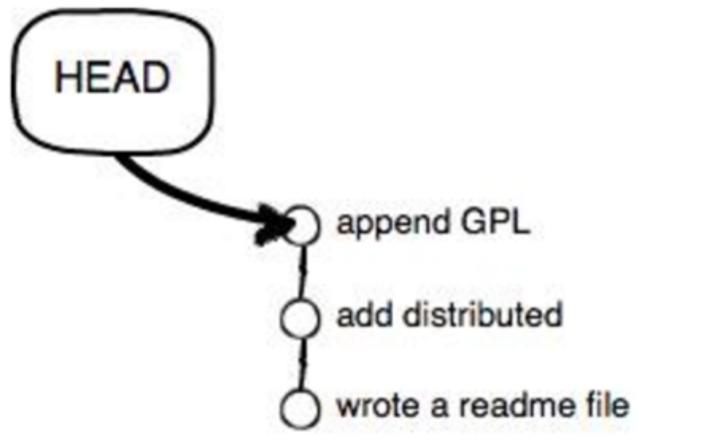
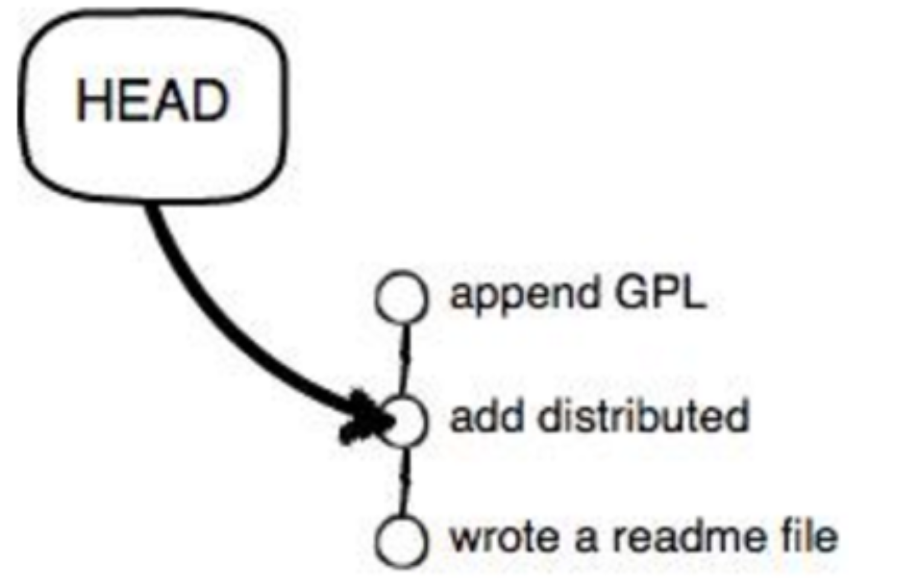
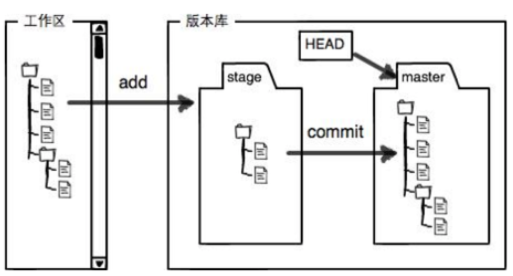
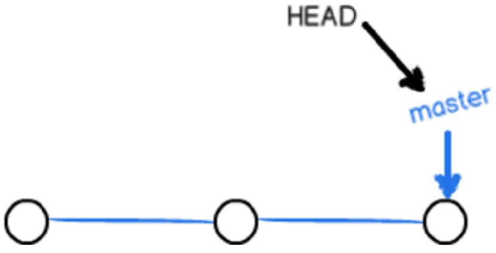

[TOC]
## 第一次安装设置
```
#因为git是分布式,所以每个机器都要自报家门
$ git config --global user.name "Your Name"
$ git config --global user.email "email@example.com"
```

## 创建版本仓库
```
$ git init #创建版本仓库  
$ git add #添加文件到版本仓库(可同时添加多个文件空格分割)
$ git commit -m '注释内容' #提交版本  
```

## 版本比对
```
$ git status #查看版本库状态以及文件修改状态
1.未修改状态:nothing to commit,working tree clean
2.修改后文件已在缓存区:Changes to be commited
3.新增文件状态:Untracked files
4.修改后文件未在缓存区:Changes not staged for commit
3与4状态区别在于3无法用git commit –am命令将文件添加到本地仓库µ


$ git diff 文件名 #查看文件异同
```

## 版本回退
```
$ git log [--pretty] #显示从最近到最远的提交日志.--pretty 只显示一行
```
> 和SVN不一样,GIT每个提交版本的commit id不是1,2,3...的数字而是一个SHA1计算出来的十六进制数字.因为GIT是分布式控制系统,如果用1,2,3...数字表示多人协作会重复.

```
HEAD #表示最新提交的版本
HEAD^ #表示上一个提交版本
HEAD~100 #表示往上100个版本(~ 代替多个 ^)
|
#git reset 版本号
$ git reset --hard HEAD^ #回退到上个版本
```

> git reset 后面如果是版本号不用写全,只写前几位就可以了.GIT版本回退非常快,因为GIT在内部有个指向当前版本的HEAD指针,当回退版本时GIT仅仅是把HEAD从指向当前版本改为指向回退版本(如下图),顺便把工作区更新了.





> 由于git log仅显示从当前版本到历史版本的纪录,如果回退了某个版本,又想还原到最新版本怎么办呢?

```
$ git reflog #此命令用来记录你的第一次命令
```

## 工作区和暂存区
> git和其它版本控制系统,如SVN的一个不同之处就是有暂存区的概念.
`工作区`:就是电脑能看到的仓库文件夹目录.
`版本库`:工作区内的隐藏目录.git,这个不算工作区,而是git的版本库.
GIT版本库里存了很多东西,其中最重要的就是stage(或者叫index)的暂存区,还有GIT为我们自动创建的第一个分支master,以及一个指向master的指针HEAD.
实际上git add就是把所有修改放到暂存区,git commit是把暂缓区的修改提交到分支.
**因此,修改一个文件后必须要添加(git add)到暂存区,才能提交(git commit)到分支,否则提交无效**


## 撤销修改
```
$ git checkout -- 文件名 #撤销工作区文件的修改(如果没有--应变成了切换分支的命令)
$ git reset HEAD 文件名 #撤销暂存区文件修改(HEADH表示撤销到最新版本)
```

## 删除文件
```
$ git rm 文件名 #从版本库中删除文件
```
> GIT删除(git rm)文件后,直接提交(git commit)即可,不需要再添加到暂存区(git add).
> 如果不小心删错了,可以直接撤销修改(git checkout -- 文件名)
> 如果文件以经提交到版本库,那么永远不用担心误删,但只能恢复到最新版本库,最新修改将丢失.

## 远程仓库<a name="h2_remote_orgin"></a>
```
$ git remote add origin 远程仓库地址 #关联远程仓库(origin是git远程仓库的默认名,可以修改)
$ git push #本地内容推送到远程仓库
```
> 关联后第一次推送仓库的所有内容使用命令:git push -u origin master
> 此后,每次推送本地修改内容可以使用命令:git push origin master

```
	$ git clone 远程仓库地址 #克隆远程仓库到本地
```

## 分支管理
> Git里默认有一个主分支master，其中HEAD严格来说指向的不是提交，而是当前分支，分支才指向提交。  


> Git创建一个分支只是增加一个指针，然后将HEAD指向新的分支 ，表示在当前分支，工作区的文件没有任何变化。  

```
$ git branch 分支名 #创建分支
$ git checkout 分支名 #切换分支
#上面两个命令相当于
$ git checkout -b 分支名 #创建并切换分支(加上-b表示先创建后切换)

$ git branch #列出所有分支
$ git merge 分支名 #合并指定分支到当前分支
$ git branch -d 分支名 #删除已合并分支
$ git branch -D 分支名 #强制删除未合并的分支
```
#### 分支管理策略
> 通常，合并分支，如果可能Git会用Fast Forward模式，但这种模式下，删除分支后，会丢掉分支信息。  
如果强制禁用Fast Forward模式，Git会在merge时生成一个新的commit，这样从分支历史上就可以看出分支信息。

```
$ git merge --no-ff -m 注释 分支名 #合并分支(--no-ff表示禁用Fast Forward模式，因为要生成一个新的commit所以要加上-m注释参数)
```
#### Bug分支
> 当一个分支的工作还没有做完，不能提交，而此时又要及时做其它工作时，可以先把工作区储藏起来。

```
$ git stash #储藏工作区(储藏后再用git status查看就是干净的, 除非是没有被git管理的文件 )
$ git stash list #查看stash列表
$ git stash apply #恢复stash，但stash不删除
$ git stash pop #恢复stash，同时删除stash
```
> 如果多次执行stash后，恢复stash就加上stash名，如：git stash pop/apply stash@{0}

#### Feature分支
> 开发新功能时最好创建一个新的分支。

#### 推送分支(<a href="#h2_remote_orgin">同远程仓库</a>)
```
$ git push origin 分支名 #推送分支到远程仓库
```
#### 抓取分支
```
$ git pull #抓取分支
$ git branch --set-upstream 分支名 origin/分支名 #第一次抓取分支需要先将本地分支与远程库分支时行连接。
```
#### 多人协作
> 当从远程仓库克隆时，Git自动把本地master分支和远程分支对应起来。并且远程分为默认名是origin。

```
$ git remote #显示远程仓库名
$ git remote -v #显示远程仓库信息
origin  git@github.com:WindusL/LearningNotes.git (fetch)
origin  git@github.com:WindusL/LearningNotes.git (push)
```
> 上面显示了可以抓取和推送的origin地址。如果没有推送权限就看不到push的地址。  
多人协作的工作模式：  
1.试图推送分支。  
2.推送失败则要先抓取远程分支，试图合并。  
3.合并有冲突，则解决冲突，并在本地提交。  
4.没有冲突或解决掉了冲突，再推送到远程分支。

## 标签管理
> 发布新版本时，通常在版本库打一个标签，来确定打标签时刻的版本。将来无论什么时候，取某个标签的版本就是那个打标签时候的历史版本。所以，标签也相当于版本库的一个快照。  
Git标签虽然是版本库的快照，但其实就是一个指向commit的指针（与分支类似，但分支可以移动，但标签不能移动）。所以，创建标签也是瞬间完成的。

```
$ git tag #查看所有标签
$ git tag 标签名 #打标签
$ git tag 标签名 commitId #给指定commit打标签
$ gti show 标签名 #查看标签信息

$ git tag -a 标签名 -m 注释 commitId #创建带有说明的标签

$ git tag -d 标签名 #删除标签
```
> 还可以通过-s用私钥签名一个标签,采用PGP签名必须先安装gpg

```
$ git tag -s 标签名 -m 注释 commitId
```
> 推送远程标签

```
$ git push origin 标签名 #推送指定标签到远程仓库
$ git push origin --tags #推送全部尚未推送到远程仓库的标签
```
> 删除远程标签

```
$ git tag -d 标签名 #先删除本地标签
$ git push origin :refs/tags/标签名 #然后删除远程标签
```


