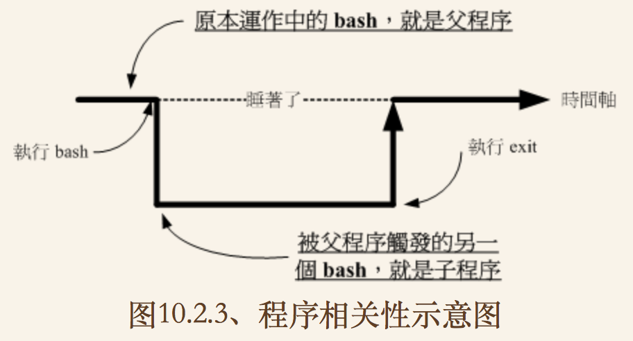
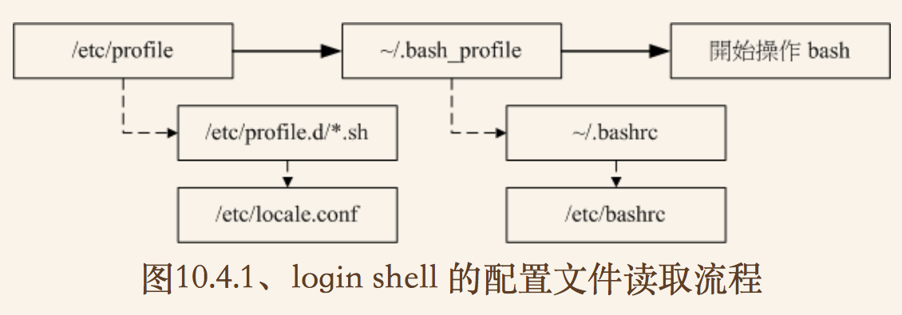

[TOC]
## Shell
/etc/shells记录系统所有shell
## Bash shell 功能
### 命令编修能力  

> 默认指令记忆功能可以达到1000个
> 记录位置~/.bash_history(当前指令用户指令在内存中,登出后才记录到文件此内)

- 命令与文件实例功能(tab补全)
- 命令别名设置功能
- 工作控制/前景背景控制
- 程序化脚本shell script
- 万用字符(*)

### type指令
type 这个指令我们可以知道每个指令是否为 bash 的内置指令。 此外，type只能查找可执行文件.

```
[dmtsai@study ~]$ type [-tpa] name
选项与参数：
    ：不加任何选项与参数时，type 会显示出 name 是外部指令还是 bash 内置指令
-t  ：当加入 -t 参数时，type 会将 name 以下面这些字眼显示出他的意义：
      file    ：表示为外部指令；
      alias   ：表示该指令为命令别名所设置的名称；
      builtin ：表示该指令为 bash 内置的指令功能；
-p  ：如果后面接的 name 为外部指令时，才会显示完整文件名；
-a  ：会由 PATH 变量定义的路径中，将所有含 name 的指令都列出来，包含 alias
```

### 快速编辑
- 反斜杠( \\ )
命令输入太长需要换行,利用反斜杠( \\ )[Enter]开启下一行,而不执行命令.  
**注意: [Enter] 按键是紧接着反斜线 （ \\ ）**

- 快捷键

<table>
	<tr>
		<th>组合键</th>
		<th>功能与示范</th>
	</tr>
	<tr>
		<td>[ctrl]+u/[ctrl]+k</td>
		<td>分别是从光标处向前删除指令串 （[ctrl]+u） 及向后删除指令串 （[ctrl]+k） </td>
	</tr>
	<tr>
		<td>[ctrl]+a/[ctrl]+e</td>
		<td>分别是让光标移动到整个指令串的最前面 （[ctrl]+a） 或最后面 （[ctrl]+e） </td>
	</tr>
	<tr>
		<td>Ctrl + C</td>
		<td>终止目前命令</td>
	</tr>
	<tr>
		<td>Ctrl + D</td>
		<td>输入结束(EOF),例如:邮件结束的时候</td>
	</tr>
	<tr>
		<td>Ctrl + M</td>
		<td>就是Enter</td>
	</tr>
	<tr>
		<td>Ctrl + S</td>
		<td>暂停屏幕输出</td>
	</tr>
	<tr>
		<td>Ctrl + Q</td>
		<td>恢复屏幕输出</td>
	</tr>
	<tr>
		<td>Ctrl + U</td>
		<td>在提示字符下，将整列命令删除</td>
	</tr>
	<tr>
		<td>Ctrl + Z</td>
		<td>“暂停”目前的命令</td>
	</tr>
</table>

### 变量
- echo 指令
显示变量内容,"-e"选项可以格式化打印内容

```
[dmtsai@study ~]$ echo $PATH
```

- 变量设置规则
	1. 变量与变量内容以一个"="来连接.  
		`myname=Windus`
	2. 等号两边不能直接接空白符.
	
		```
		#错误
		myname= Windus
		myname=Windus L
		```
	
	3. 变量内容若有空白符可使用双引号或单引号将变量内容结合起来.  
	
		```
		#双引号内特殊字符可保持原本特性,如:"$"等
		var="lang is $LANG"
		echo $var --> lang is UTF8
		
		#单引号内的特殊字符仅为一般字符(纯文本)
		var='lang is $LANG'
		echo $var --> lang is $LANG
		```  
	
	4. 变量名称只能是英文字母与数字,但开头字符不能是数字.
	5. 可用跳脱字符" \\ ",将特殊符号变成一般符号。(如： [Enter], $, \, 空白字符等）  
		`myname=Windus\ L`
	6. 在一串指令的执行中，还需要借由其他额外的指令所提供的信息时，可以使用反单引号“`指令`”或 “$（指令） 
		
		```
		version=$（uname -r）
		echo $version --> 3.10.0-229.el7.x86_64
		```
		
	7. 若该变量为扩增变量内容时，则可用 "\$变量名称" 或 ${变量} 累加内容
		
		```
		PATH="$PATH":/home/bin
		或
		PATH=${PATH}:/home/bin
		```
		
	8. 若该变量需要在其他子程序执行，则需要以 export 来使变量变成环境变量
		`export PATH`
		
	9. 通常大写字符为系统默认变量，自行设置变量可以使用小写字符，方便判断 （纯粹依照使用者兴趣与嗜好,在 Linux 默认的情况中，使用{大写的字母}来设置的变量一般为系统内定需要的变量）
	10. 取消变量用unset
		`unset myname`

#### 环境变量
- env命令  
	查看所有环境变量
	- HOME 使用者主文件夹变量, ~就会读取此变量
	- SHELL 目前环境使用的SHELL程序(Linux默认:/bin/bash)
	- HISTSIZE 历史命令记录笔数
	- MAIL 当前用户邮箱文件
	- PATH 可执行文件搜寻的路径(目录与目录中间:分隔).由于搜寻顺序依据PATH变量内目录顺序,所以目录顺序也是重要的.
	- LANG 语系数据
	- RANDOM 随机数变量(/dev/random),内容介于0~32767之间.
		
		```
		#想要获取指定范围内的数,使用delcare声名数值类型
		[dmtsai@study ~]$ declare -i number=$RANDOM*10/32768 ; 
		echo $number
		8   <== 此时会随机取出 0~9 之间的数值喔！
		```
- set命令
	查看所有变量(含环境变量与自定变量)
	- PS1 提示字符的设置
		
		```
		\d ：可显示出“星期 月 日”的日期格式，如："Mon Feb 2"
		\H ：完整的主机名称。举例来说，鸟哥的练习机为“study.centos.vbird”
		\h ：仅取主机名称在第一个小数点之前的名字，如鸟哥主机则为“study”后面省略
		\t ：显示时间，为 24 小时格式的“HH:MM:SS”
		\T ：显示时间，为 12 小时格式的“HH:MM:SS”
		\A ：显示时间，为 24 小时格式的“HH:MM”
		\@ ：显示时间，为 12 小时格式的“am/pm”样式
		\u ：目前使用者的帐号名称，如“dmtsai”；
		\v ：BASH 的版本信息，如鸟哥的测试主机版本为 4.2.46（1）-release，仅取“4.2”显示
		\w ：完整的工作目录名称，由根目录写起的目录名称。但主文件夹会以 ~ 取代；
		\W ：利用 basename 函数取得工作目录名称，所以仅会列出最后一个目录名。
		\# ：下达的第几个指令。
		\$ ：提示字符，如果是 root 时，提示字符为 # ，否则就是 $ 
		```
		
	- \$ 本shell的PID  
		`echo $$`
	- ? 上个指令的回传值
		执行某些指令时， 这些指令都会回传一个执行后的代码。一般来说，如果成功的执行该指令， 则会回传一个 0 值,如果执行过程发生错误,就会传回错误代码.一般以非0代码取代.
		
- export命令  
	当你登陆 Linux 并取得一个 bash 之后，你的 bash 就是一个独立的程序，这个程序的识别使用的是一个称为程序识别码，被称为 PID 的就是。 接下来你在这个 bash 下面所下达的任何指令都是由这个 bash 所衍生出来的，那些被下达的指令就被称为子程序了.
	

	子程序仅会继承父程序的环境变量， 子程序不会继承父程序的自订变量.所以你在原本 bash 的自订变量在进入了子程序后就会消失不见， 一直到你离开子程序并回到原本的父程序后，这个变量才会又出现！
此时,把自定变量变成环境变量就变得很有必要了:
`export 变量名称`

如果export后面不加变量名称,就会将系统所有变量列出来,等同于set命令.

#### 语系变量
- 查看Linux支持的语系
	
	```
	[dmtsai@study ~]$ locale -a
	....（前面省略）....
	zh_TW
	zh_TW.big5     <==大五码的中文编码
	zh_TW.euctw
	zh_TW.utf8     <==万国码的中文编码
	zu_ZA
	zu_ZA.iso88591
	zu_ZA.utf8
	```
	
- 修改Linux语系

	```
	locale  <==后面不加任何选项与参数即可！
	LANG=en_US                   <==主语言的环境
	LC_CTYPE="en_US"             <==字符（文字）辨识的编码
	LC_NUMERIC="en_US"           <==数字系统的显示讯息
	LC_TIME="en_US"              <==时间系统的显示数据
	LC_COLLATE="en_US"           <==字串的比较与排序等
	LC_MONETARY="en_US"          <==币值格式的显示等
	LC_MESSAGES="en_US"          <==讯息显示的内容，如功能表、错误讯息等
	LC_ALL=                      <==整体语系的环境
	....（后面省略）....
	```
	
	可以逐一设置每个与语系有关的变量数据,可也以直接设置LANG或LC_ALL(其它语系变量会被这两个变量所取代).
	
	系统默认语系文件是: **/etc/locale.conf**

#### 变量范围
环境变量可以被子程序引用的原理:
1. 当启动一个shell,系统会分配一个记忆区给shell使用,使此内存内的变量,即环境变量可让子程序使用.
2. 若父程序用export功能,将自定变量内容写到上述内存区块当中(环境变量).
3. 当载入另一个shell时(亦启动一个子程序,离开原本父程序),子程序可以将父shell的环境变量所在记忆区导入自己的环境变量区块当中.

#### 变量键盘读取/阵列与宣告
- read命令
	程序执行的过程当中，会等待使用者输入 "yes/no" 之类的讯息,和使用者对谈时使用此命令.

	```
	[dmtsai@study ~]$ read [-pt] variable
	选项与参数：
	-p  ：后面可以接提示字符！
	-t  ：后面可以接等待的“秒数！”这个比较有趣～不会一直等待使用者啦！
	```

- declare/typeset
	declare 或 typeset 是一样的功能，就是在“宣告变量的类型.
	
	```
	[dmtsai@study ~]$ declare [-aixr] variable
	选项与参数：
	-a  ：将后面名为 variable 的变量定义成为阵列 （array） 类型
	-i  ：将后面名为 variable 的变量定义成为整数数字 （integer） 类型
	-x  ：用法与 export 一样，就是将后面的 variable 变成环境变量；
	-r  ：将变量设置成为 readonly 类型，该变量不可被更改内容，也不能 unset
	-p	 : 仅列出变量类型
	
	范例一：让变量 sum 进行 100+300+50 的加总结果
	[dmtsai@study ~]$ sum=100+300+50
	[dmtsai@study ~]$ echo ${sum}
	100+300+50  <==咦！怎么没有帮我计算加总？因为这是文字体态的变量属性啊！
	[dmtsai@study ~]$ declare -i sum=100+300+50
	[dmtsai@study ~]$ echo ${sum}
	450         <==瞭乎？？
	```
	
	> 注意 : bash环境下,变量类型默认为“字串”，所以若不指定变量类型，则 1+2 为一个“字串”而不是“计算式”。 所以上述第一个执行的结果才会出现那个情况的；
bash 环境中的数值运算，默认最多仅能到达整数形态，所以 1/3 结果是 0； 

#### 变量内容删除/取代/替换
***
暂时跳过
***
	
### 系统限制关系 ulimit  

```
[dmtsai@study ~]$ ulimit [-SHacdfltu] [配额]
选项与参数：
-H  ：hard limit ，严格的设置，必定不能超过这个设置的数值；
-S  ：soft limit ，警告的设置，可以超过这个设置值，但是若超过则有警告讯息。
      在设置上，通常 soft 会比 hard 小，举例来说，soft 可设置为 80 而 hard 
      设置为 100，那么你可以使用到 90 （因为没有超过 100），但介于 80~100 之间时，
      系统会有警告讯息通知你！
-a  ：后面不接任何选项与参数，可列出所有的限制额度；
-c  ：当某些程序发生错误时，系统可能会将该程序在内存中的信息写成文件（除错用），
      这种文件就被称为核心文件（core file）。此为限制每个核心文件的最大容量。
-f  ：此 shell 可以创建的最大文件大小（一般可能设置为 2GB）单位为 KBytes
-d  ：程序可使用的最大断裂内存（segment）容量；
-l  ：可用于锁定 （lock） 的内存量
-t  ：可使用的最大 CPU 时间 （单位为秒）
-u  ：单一使用者可以使用的最大程序（process）数量。
```

### 命令别名与历史命令
#### 别名设置 alias / unalias

```
#设置别名
[dmtsai@study ~]$ alias lm='ls -al | more
#取消别名
[dmtsai@study ~]$ unalias lm
```

> 设置别名,在机器重启后将丢失,如果想永久存在,需要写在~/.bash_profile文件内

#### 历史命令 history
历史命令记录在~/.bash_history文件中,记录的数量由HISTFILESIZE环境变量决定.

```
[dmtsai@study ~]$ history [-raw] histfiles
选项与参数：
n   ：数字，意思是“要列出最近的 n 笔命令列表”的意思！
-c  ：将目前的 shell 中的所有 history 内容全部消除
-a  ：将目前新增的 history 指令新增入 histfiles 中，若没有加 histfiles ，
      则默认写入 ~/.bash_history
-r  ：将 histfiles 的内容读到目前这个 shell 的 history 记忆中；
-w  ：将目前的 history 记忆内容写入 histfiles 中！
```

- 历史命令的使用:

	```
	[dmtsai@study ~]$ !
	选项与参数：
	number  ：执行第几笔指令的意思；
	command ：由最近的指令向前搜寻“指令串开头为 command”的那个指令，并执行；
	!!      ：就是执行上一个指令（相当于按↑按键后，按 Enter）
	```

- 同一帐号同时多次登陆的history写入问题

	因为这些 bash 在同时以同一个身份登陆， 因此所有的 bash 都有自己的 1000 笔记录在内存中。因为等到登出时才会更新记录文件，所以，最后登出的那个 bash 才会是最后写入的数据。如此一来其他 bash 的指令操作就不会被记录下来了 （其实有被记录，只是被后来的最后一个 bash 所覆盖更新了） 。

- 历史命令时间问题
	历史命令还有一个问题，那就是无法记录指令下达的时间。由于这 1000 笔历史命令是依序记录的， 但是并没有记录时间，所以在查询方面会有一些不方便。其实可以通过~/.bash_logout 来进行 history 的记录，并加上 date 来增加时间参数.

## Bash Shell操作环境

### Bash 进站欢迎信息 /etc/issue  /etc/motd

```
issue 内的各代码意义:
	\d 本地端时间的日期；
	\l 显示第几个终端机接口；
	\m 显示硬件的等级 （i386/i486/i586/i686...）；
	\n 显示主机的网络名称；
	\O 显示 domain name；
	\r 操作系统的版本 （相当于 uname -r）
	\t 显示本地端时间的时间；
	\S 操作系统的名称；
	\v 操作系统的版本
```

> 当我们使用 telnet 连接到主机时，主机的登陆画面就会显示 /etc/issue.net 而不是 /etc/issue
> /etc/motd 里面显示的则是文字信息

### bash环境配置文件
#### login与non-login Shell
- login shell：取得 bash 时需要完整的登陆流程的，就称为 login shell。举例来说，你要由 tty1 ~ tty6 登陆，需要输入使用者的帐号与密码，此时取得的 bash 就称为“ login shell ”

- non-login shell：取得 bash 接口的方法不需要重复登陆的举动，举例来说，（1）你以 X window 登陆 Linux 后， 再以 X 的图形化接口启动终端机，此时那个终端接口并没有需要再次的输入帐号与密码，那个 bash 的环境就称为 non-login shell了。（2）你在原本的 bash 环境下再次下达 bash 这个指令，同样的也没有输入帐号密码， 那第二个 bash （子程序） 也是 non-login shell 。

> 这两个Shell，读取的配置文件数据并不一样.

#### /etc/profile (login Shell读取)
这个配置文件可以利用使用者的识别码 （UID） 来决定很多重要的变量数据， 也是每个使用者登陆取得 bash 时一定会读取的配置文件.所以设置全局环境就要改这个文件!

```
主要变量:
PATH：会依据 UID 决定 PATH 变量要不要含有 sbin 的系统指令目录；
MAIL：依据帐号设置好使用者的 mailbox 到 /var/spool/mail/帐号名；
USER：根据使用者的帐号设置此一变量内容；
HOSTNAME：依据主机的 hostname 指令决定此一变量内容；
HISTSIZE：历史命令记录笔数。CentOS 7.x 设置为 1000 ；
umask：包括 root 默认为 022 而一般用户为 002 等！
```

> /etc/profile 还会调用外部的设置数据,主要有如下:

- /etc/profile.d/*.sh
	“这个目录内的众多文件！只要在 /etc/profile.d/ 这个目录内且扩展名为 .sh ，另外，使用者能够具有 r 的权限， 那么该文件就会被 /etc/profile 调用进来。在 CentOS 7.x 中，这个目录下面的文件规范了 bash 操作接口的颜色、 语系、ll 与 ls 指令的命令别名、vi 的命令别名、which 的命令别名等等。如果你需要帮所有使用者设置一些共享的命令别名时， 可以在这个目录下面自行创建扩展名为 .sh 的文件，并将所需要的数据写入即可！

- /etc/locale.conf
	这个文件是由 /etc/profile.d/lang.sh 调用进来的！这也是我们决定 bash 默认使用何种语系的重要配置文件！ 文件里最重要的就是 LANG/LC_ALL 这些个变量的设置！

- /usr/share/bash-completion/completions/*
	这个目录下除前面谈过 [tab] 命令补齐、文件名补齐之外，还可以进行指令的选项/参数补齐功能！那就是从这个目录里面找到相对应的指令来处理的！ 其实这个目录下面的内容是由 /etc/profile.d/bash_completion.sh 这个文件载入的啦！

#### ~/.bash_profile (login Shell读取)
bash 在读完了整体环境设置的 /etc/profile 并借此调用其他配置文件后，接下来则是会读取使用者的个人配置文件。 在 login shell 的 bash 环境中，所读取的个人偏好配置文件其实主要有三个，依序分别是：

```
1. ~/.bash_profile
2. ~/.bash_login
3. ~/.profile
```

其实 bash 的 login shell 设置只会读取上面三个文件的其中一个， 而读取的顺序则是依照上面的顺序。也就是说，如果 ~/.bash_profile 存在，那么其他两个文件不论有无存在，都不会被读取。 如果 ~/.bash_profile 不存在才会去读取 ~/.bash_login，而前两者都不存在才会读取 ~/.profile 的意思。 会有这么多的文件，其实是因应其他 shell 转换过来的使用者的习惯而已。



#### source 读入环境配置文件指令
由于 /etc/profile 与 ~/.bash_profile 都是在取得 login shell 的时候才会读取的配置文件，所以， 如果你将自己的偏好设置写入上述的文件后，通常都是得登出再登陆后，该设置才会生效。利用这个指令可以直接生效!

```
[dmtsai@study ~]$ source 配置文件文件名

范例：将主文件夹的 ~/.bashrc 的设置读入目前的 bash 环境中
[dmtsai@study ~]$ source ~/.bashrc  <==下面这两个指令是一样的！
[dmtsai@study ~]$  .  ~/.bashrc
```

#### ~/.bashrc （non-login shell 读取）
CentOS 7.x 还会主动的调用 /etc/bashrc 这个文件
```
/etc/bashrc文件记录内容
1. 依据不同的 UID 规范出 umask 的值；
2. 依据不同的 UID 规范出提示字符 （就是 PS1 变量）；
3. 调用 /etc/profile.d/*.sh 的设置
```

> /etc/bashrc文件是Red Hat系统特有的,如果此文件丢失,可以复制 /etc/skel/.bashrc 到你的主文件夹.

### 终端机环境设置 stty , set
#### stty命令 
查阅目前的一些按键内容

```
[dmtsai@study ~]$ stty [-a]
选项与参数：
-a  ：将目前所有的 stty 参数列出来；

#列出所有的按键与按键内容
[dmtsai@study ~]$ stty -a
speed 38400 baud; rows 20; columns 90; line = 0;
intr = ^C; quit = ^\; erase = ^?; kill = ^U; eof = ^D; eol = <undef>; eol2 = <undef>;
swtch = <undef>; start = ^Q; stop = ^S; susp = ^Z; rprnt = ^R; werase = ^W; lnext = ^V;
flush = ^O; min = 1; time = 0;
....（以下省略）....

#设置按键
[dmtsai@study ~]$ stty erase ^h

意义:
intr  : 送出一个 interrupt （中断） 的讯号给目前正在 执行的程序 （就是终止啰！）；
quit  : 送出一个 quit 的讯号给目前正在执行的程序；
erase : 向后删除字符，
kill  : 删除在目前命令行上的所有文字；
eof   : End of file 的意思，代表“结束输入”。
start : 在某个程序停止后，重新启动他的 output
stop  : 停止目前屏幕的输出；
susp  : 送出一个 terminal stop 的讯号给正在 run 的程序。
```

#### set命令


