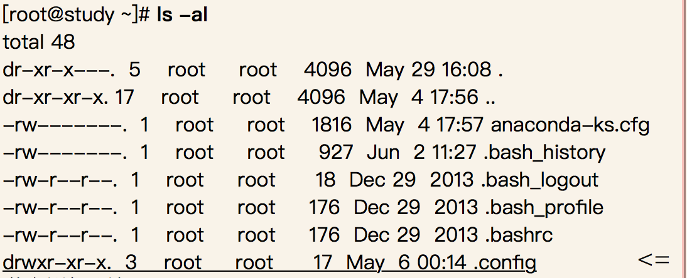
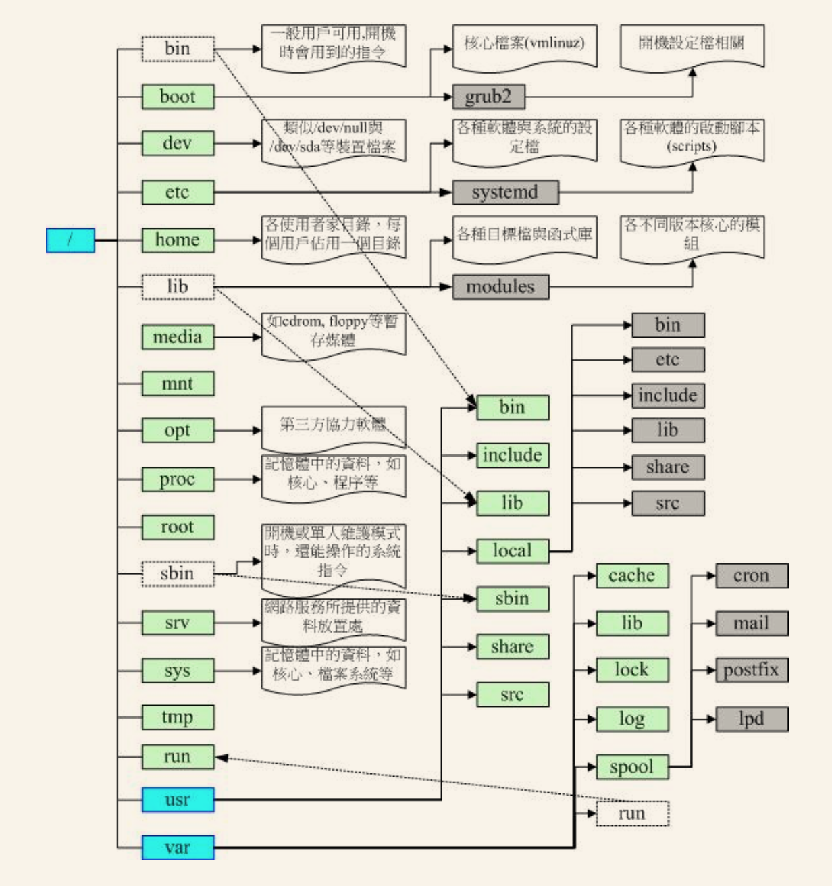

[TOC]
## 文件属性


<!--more-->

- 第一栏代表文件类型与权限
> **列表第一个字符意义:**  
当为[ d ]则是目录，例如上表文件名为“.config”的那一行；  
当为[ - ]则是文件，例如上表第三行；   
若是[ l ]则表示为链接文件（link file）；  
若是[ b ]则表示为设备文件里面的可供储存的周边设备（可随机存取设备）；  
若是[ c ]则表示为设备文件里面的序列埠设备，例如键盘、鼠标（一次性读取设备）。  

- 第二栏表示有多少文件名链接到此节点上
- 第三栏表示这个文件“拥有者账号”
- 第四栏表示这个文件所属群组
- 第五栏表示这个文件大小，默认单位Bytes
- 第六栏表示文件的创建日期或修改日期
- 第七栏为文件名

## 改变文件属性与权限
- 改变文件群组

> chgrp [-R] 群组名 文件或目录
 
- 改变文件拥有者
 
> chown [-R] 账号名:群组名 文件或目录

- 改变权限  
*数字类型改变文件权限*  

  > r:4 w:2 o:1  
chmod [-R] 权限和 文件/文件夹  

  *符号类型改变文件权限* 
  
  > user:u group:g others:o all:a  
  +加入权限 -去除权限 =设置权限  
  写法:  
  chmod [-R] u=rwx,g=rw,o=rw 文件/文件夹

## Linux目录配置

### HFS要求必须存在的目录
  1. **/bin** 放置的是单人维护模式下还能够被操作的命令。主要有：cat、chmod、chown、date、mv、mkdir、cp、bash等常用指令。  
  2. **/boot** 此目录主要放置在开机会使用的文件,包括Linux核心文件以及开机菜单与开机所需要的配置文件等等。  
  3. **/dev** Linux上,任何设置与周边设置都以文件形态存在于这个目录。通过读取这个目录下的文件，就等于存取这个设备。比较重要的文件有：/dev/null,/dev/zero,/dev/tty等等。
  4. **/etc** 系统主要配置文件几乎都放在这个目录内,例如人员账号密码档、各种服务启动档等等。一般来说这个目录文件可以让一般用户查阅，但是只有root用户可以修改。***FHS建议不要放置可可执行文件(binary)在这个目录中。*** 比较重要的文件有：/etc/modprobe.d/, /etc/passwd, /etc/fstab, /etc/issue  
      > /etc/opt(必要) 这个目录放置第三方软件/opt的相关配置文件。

  5. **/lib** 放置的是开机时会用到的函数库,以及在/bin或/sbin下指令会调用的函数库.
      > **/lib/modules** (必要) 这个目录放置可抽换式的核心模块(驱动程序)

  6. **/media** 放置可移除设置。包括：软盘、光盘、DVD等等设置都暂时挂载于此。常见的文件名有：/media/floppy, /media/cdrom等等。
  7. **/mnt** 如果你想要暂时挂载某些额外的设备，一般建议你可以放置到这个目录中。 在早时候，这个目录的用途与/media相同啦！只是有了/media之后，这个目录就用来暂时挂载用了。
  8. **/opt** 第三方协力软件放置的目录。什么是第三方协力软件啊？ 举例来说，KDE这个桌面管理系统是一个独立的计划，不过他可以安装到Linux系统中，因此KDE的软件就建议放置到此目录下了。 另外，如果你想要自行安装额外的软件（非原本的distribution提供的），那么也能够将你的软件安装到这里来。 不过，以前的Linux系统中，我们还是习惯放置在/usr/local目录下呢！  
  9. **/run** 早期的 FHS 规定系统开机后所产生的各项信息应该要放置到 /var/run 目录下，新版的 FHS 则规范到 /run 下面。 由于 /run 可以使用内存来仿真，因此性能上会好很多！
  10. **/sbin** 放在/sbin下面的为开机过程中所需要的，里面包括了开机、修复、还原系统所需要的指令。 至于某些服务器软件程序，一般则放置到/usr/sbin/当中。至于本机自行安装的软件所产生的系统可执行文件（system binary）， 则放置到/usr/local/sbin/当中了。常见的指令包括：fdisk, fsck, ifconfig, mkfs等等。
  11. **/srv** srv可以视为“service”的缩写，是一些网络服务启动之后，这些服务所需要取用的数据目录。 常见的服务例如WWW, FTP等等。举例来说，WWW服务器需要的网页数据就可以放置在/srv/www/里面。 不过，系统的服务数据如果尚未要提供给网际网络任何人浏览的话，默认还是建议放置到 /var/lib 下面即可。
  12. **/tmp** 这是让一般使用者或者是正在执行的程序暂时放置文件的地方。 这个目录是任何人都能够存取的，所以你需要定期的清理一下。当然，重要数据不可放置在此目录啊！ 因为FHS甚至建议在开机时，应该要将/tmp下的数据都删除唷！
  13. **/usr** 第二层FHS设置,见后续...
  14. **/var** 第二层FHS设置,见后续...
   
### HFS要求可以存在的目录
  1. **/home** 这是系统默认的使用者主文件夹（home directory）。在你新增一个一般使用者帐号时， 默认的使用者主文件夹都会规范到这里来
    > ~：代表目前这个使用者的主文件夹  
~dmtsai ：则代表 dmtsai 的主文件夹！

  2. **/lib\<qual>** 用来存放与 /lib 不同的格式的二进制函数库，例如支持 64 位的 /lib64 函数库等
  3. **/root** 系统管理员（root）的主文件夹。之所以放在这里，是因为如果进入单人维护模式而仅挂载根目录时， 该目录就能够拥有root的主文件夹，所以我们会希望root的主文件夹与根目录放置在同一个分区中。
  
***
事实上FHS针对根目录定义的标准仅有上面这些,不过Linux还有许多目录需要了解一下.下面几个目录也非常重要:
***
1. **/lost+found** 这个目录是使用标准的ext2/ext3/ext4文件系统格式才会产生的一个目录，目的在于当文件系统发生错误时， 将一些遗失的片段放置到这个目录下。不过如果使用的是 xfs 文件系统的话，就不会存在这个目录了！
2. **/proc** 这个目录本身是一个虚拟目录.它放置 的数据都是在内存中.例如系统核心、行程信息、周边设备状态以及网络状态等等。因为这个目录数据都在内存当中，所以本身不占任何磁盘空间。比较重要的文件例如：/proc/cpuinfo, /proc/dma, /proc/interrupts, /proc/ioports, /proc/net/* 等等。
3. **/sys** 这个目录其实跟/proc非常类似，也是一个虚拟的文件系统，主要也是记录核心与系统硬件信息较相关的信息。 包括目前已载入的核心模块与核心侦测到的硬件设备信息等等。这个目录同样不占硬盘容量喔！
### /usr目录
  > **/usr** 目录是Unix Software Resource的缩写， 也就是“Unix操作系统软件资源”所放置的目录，而不是使用者的数据啦！这点要注意。 FHS建议所有软件开发者，应该将他们的数据合理的分别放置到这个目录下的次目录，而不要自行创建该软件自己独立的目录。
  
  #### FHS要求必须存在的目录
    - **/usr/bin** 所有一般用户使用的指令都放在这里! 目前CentOS7已经将全部指令放置于此,而使用链接文件的方式将 **/bin** 链接至此! 也就是说 **/bin** 与 **/usr/bin** 是一模一样了! 另外,FHS要求在此目录下不应该有子目录!
    - **/usr/lib** 基本上，与 /lib 功能相同，所以 /lib 就是链接到此目录中的！
    - **/usr/local** 系统管理员在本机自行安装自己下载的软件(非distribution默认提供者)建议安装到此目录,这样会比较方便管理. 举例来说，你的distribution提供的软件较旧，你想安装较新的软件但又不想移除旧版， 此时你可以将新版软件安装于/usr/local/目录下，可与原先的旧版软件有分别啦！ 你可以自行到/usr/local去看看，该目录下也是具有bin, etc, include, lib...的次目录喔！
    - **/usr/sbin** 非系统正常运行所需要的系统指令。最常见的就是某些网络服务器软件的服务指令（daemon）啰！不过基本功能与 /sbin 也差不多， 因此目前 /sbin 就是链接到此目录中的。
    - **/usr/share** 主要放置只读架构的数据文件，当然也包括共享文件。在这个目录下放置的数据几乎是不分硬件架构均可读取的数据， 因为几乎都是文字文件嘛！
      >常见的还有这些次目录：  
      **/usr/share/man** 线上说明文档  
      **/usr/share/doc** 软件杂项文件说明  
      **/usr/share/zoneinfo** 与时区有关的时区文件
	
  #### FHS建议可以存在的目录
    -  **/usr/games** 与游戏比较相关的数据放置处
    - **/usr/include** c/c++等程序语言的文件开始（header）与包含档（include）放置处，当我们以tarball方式 （*.tar.gz 的方式安装软件）安装某些数据时，会使用到里头的许多包含档喔！
    - **/usr/libexec** 某些不被一般使用者惯用的可执行文件或脚本（script）等等，都会放置在此目录中。例如大部分的 X 窗口下面的操作指令， 很多都是放在此目录下的。
    - **/usr/lib\<qual> 与 /lib\<qual>/功能相同，因此目前 /lib<qual> 就是链接到此目录中
    - **/usr/src** 一般源代码建议放在这里, src有source的意思. 至于核心源代码建议放到 **/usr/src/linux** 目录下.
### /var目录 
  > 如果 **/usr** 是安装时会占用较大硬盘容量的目录，那么 **/var** 就是在系统运行后才会渐渐占用硬盘容量的目录。 因为 **/var** 目录主要针对常态性变动的文件，包括高速缓存（cache）、登录文件（log file）以及某些软件运行所产生的文件， 包括程序文件（lock file, run file），或者例如MySQL数据库的文件等等
  - FHS要求必须存在的目录
    - **/var/cache** 应用程序运行中会产生的一些暂存盘
    - **/var/lib** 程序本身执行的过程中，需要使用到的数据文件放置的目录。在此目录下各自的软件应该要有各自的目录。 举例来说，MySQL的数据库放置到/var/lib/mysql/而rpm的数据库则放到/var/lib/rpm去！
    - **/var/lock** 某些设备或者是文件资源一次只能被一个应用程序所使用，如果同时有两个程序使用该设备时， 就可能产生一些错误的状况，因此就得要将该设备上锁（lock），以确保该设备只会给单一软件所使用。 举例来说，烧录机正在烧录一块光盘，你想一下，会不会有两个人同时在使用一个烧录机烧片？ 如果两个人同时烧录，那片子写入的是谁的数据？所以当第一个人在烧录时该烧录机就会被上锁， 第二个人就得要该设备被解除锁定（就是前一个人用完了）才能够继续使用啰。目前此目录也已经挪到 */run/lock* 中
    - **/var/log** 重要到不行！这是登录文件放置的目录！里面比较重要的文件如 **/var/log/messages** ,  **/var/log/wtmp**（记录登陆者的信息）等。
    - **/var/mail** 放置个人电子邮件信箱的目录，不过这个目录也被放置到 **/var/spool/mail/** 目录中！ 通常这两个目录是互为链接文件啦！
    - **/var/run** 某些程序或者服务启动后, 会将它们的PID放置在这个目录下! 与 **/run** 相同，这个目录链接到 **/run** 去了！
    - **/var/spool** 这个目录通常放置一些伫列数据，所谓的“伫列”就是排队等待其他程序使用的数据啦！ 这些数据被使用后通常都会被删除。举例来说，系统收到新信会放置到/var/spool/mail/中， 但使用者收下该信件后该封信原则上就会被删除。信件如果暂时寄不出去会被放到/var/spool/mqueue/中， 等到被送出后就被删除。如果是工作调度数据（crontab），就会被放置到/var/spool/cron/目录中！

## CentOS观察
- uname

```Linux
[dmtsai@study ~]$ uname -r   # 查看核心版本
3.10.0-229.el7.x86_64
[dmtsai@study ~]$ uname -m   # 查看操作系统的位版本
x86_64
```
- lsb_release指令已经不是默认安装软件了.使用前需要安装

```Linux
[root@study ~]# dnf install redhat-lsb
[root@study ~]# lsb_release -a
LSB Version:	:core-4.1-amd64:core-4.1-noarch:cxx-4.1-amd64:cxx-4.1-noarch:desktop-4.1-amd64:desktop-4.1-noarch:languages-4.1-amd64:languages-4.1-noarch:printing-4.1-amd64:printing-4.1-noarch
Distributor ID:	CentOS
Description:	CentOS Linux release 7.3.1611 (Core)
Release:	7.3.1611
Codename:	Core
```
- /etc/*

```
	[root@study ~]# cat /etc/issue
	CentOS release 5.5 (Final)
	Kernel r on an m
	[root@study ~]# cat /etc/redhat-release
```


