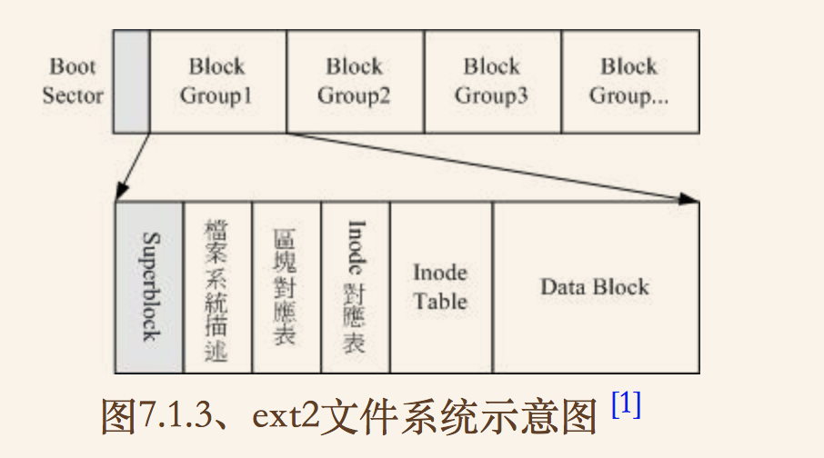
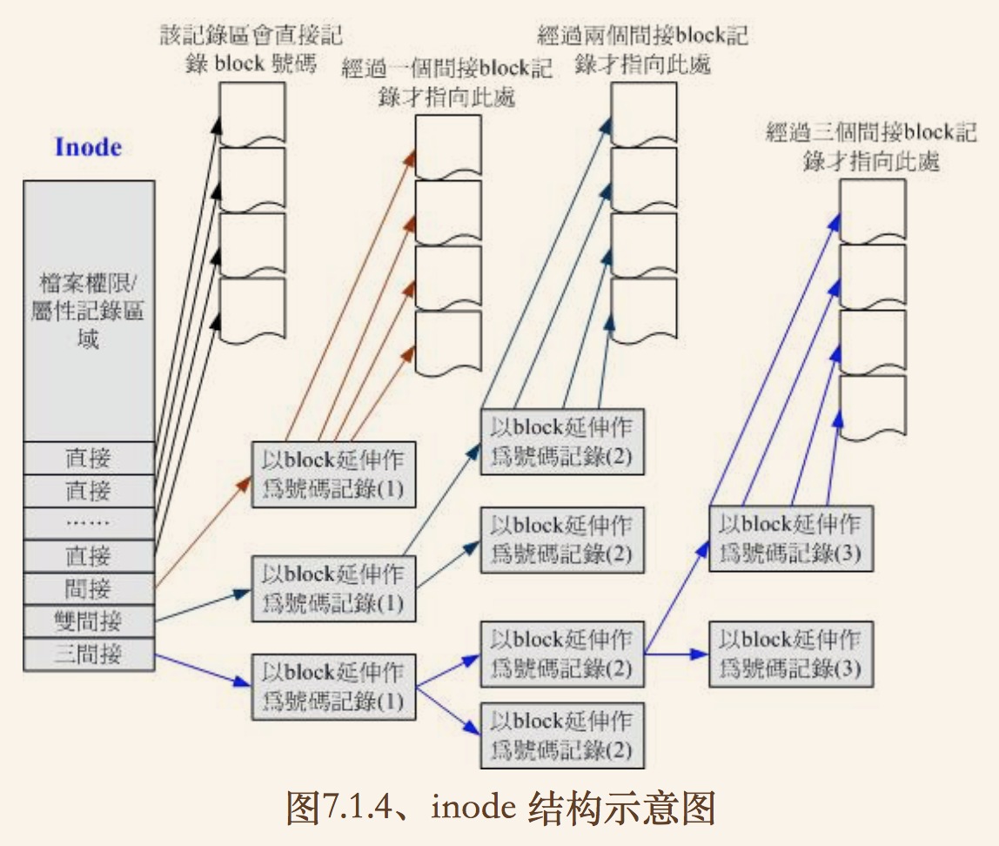

[TOC]
## EXT2文件系统  


<!--more-->

### data block 用来放置文件内容数据的地方.在EXT2文件系统中支持block大小有1k 2k 4k.  

	> 每个block大小在与数量在格式化完成后就确定,不能再改变了.(**除非格		式化或使用resize2fs等指令变更文件系统大小**)
	> 每个block最多只能放一个文件
	> 如果文件大于block大小,那文件会占用多个block
	> 如果文件大小小于block,那么剩余容量就不能再使用了(磁盘空间会浪费).
	
### inode table  
 
- 记录内容:  
> 该文件的存取模式（read/write/excute）
> 该文件的拥有者与群组（owner/group）
> 该文件的容量
> 该文件创建或状态改变的时间（ctime） 
> 最近一次的读取时间（atime）
> 最近修改的时间（mtime）
> 定义文件特性的旗标（flag），如 SetUID...
> 该文件真正内容的指向 （pointer）
> 不记录文件名(文件名记录在block上)
	
- 特点:  
> 每个 inode 大小均固定为 128 Bytes（新的 ext4 与 xfs 可设置到 		256 Bytes）
> 每个文件都仅会占用一个 inode 而已
> 承上，因此文件系统能够创建的文件数量与 inode 的数量有关
> 系统读取文件时需要先找到 inode，并分析 inode 所记录的权限与使用		者是否符合，若符合才能够开始实际读取 block 的内容。  
	

	
***inode要记录的数据特别多,而只有128Bytes.inode记录一个block号码要4Byte,所以大文件一个inode肯定是不够用的.为此,inode记录block号码区域定义了12个直接,一个间接,一个双间接,一个三间接记录区.***  
	
> 如上图,最左边为 inode 本身 （128 Bytes），里面有 12 个直接指向 block 号码的对照，这 12 笔记录就能够直接取得 block 号码啦！ 至于所谓的间接就是再拿一个 block 来当作记录 block 号码的记录区，如果文件太大时， 就会使用间接的 block 来记录号码。如上图 7.1.4 当中间接只是拿一个 block 来记录额外的号码而已。 同理，如果文件持续长大，那么就会利用所谓的双间接，第一个 block 仅再指出下一个记录号码的 block 在哪里， 实际记录的在第二个 block 当中。依此类推，三间接就是利用第三层 block 来记录号码啦！
	
```
inode指定block大小计算(block为1k):
- 12 个直接指向： 12*1K=12K
	  由于是直接,12所以总共可以记录12笔
- 1  个间接： 256*1K=256K
	  每笔 block 号码的记录会花去 4Bytes，因此 1K 的大小能够记录 256 笔记录
- 1  个双间接: 256*256*1K=2562K
	  第一层 block 会指定256个第二层,每个第二层可以指定 256个号码
- 1  个三间接： 256*256*256*1K=2563K
	  第一层 block 会指定256个第二层,每个第二层可以指定256个第三层，每个第三层可以指定 256 个号码
得到:12 + 256 + 256*256 + 256*256*256 （K） = 16GB
	
上面方法不能用在2k及4k block大小计算中,因为大于2k block将会受到EXT2文件系统本身的限制,所以计算结果会不太符合之故.
```

### super block 记录整个文件系统信息,没有它就没有文件系统  
- 记录信息  
	
> block 与 inode 的总量
> 未使用与已使用的 inode / block 数量
> block 与 inode 的大小（block为1,2,4K,inode为 128Bytes或 256Bytes）
> filesystem 的挂载时间、最近一次写入数据的时间、最近一次检验磁盘 （fsck） 的时间等文件系统的相关信息
> 一个 valid bit 数值，若此文件系统已被挂载，则 valid bit 为 0 ，若未被挂载，则 valid bit 为 1  	
	
*superblock大小为1024Bytes,文件系统除了第一个block group含有superblock以外,后续的block group都不一定含有supperblock,若含有则是对第一个block group的备份.*
	
### block bitmap (区块对照表)
	文件修改时,记录block是否被占用.  
### inode bitmap (inode对照表)
	与block bitmap功能类似,记录inode占用情况.  
### Filesystem Description （文件系统描述说明）
	这个区段可以描述每个 block group 的开始与结束的 block 号码，以及说明每个区段 （superblock, bitmap, inodemap, data block） 分别介于哪一个 block 号码之间。  
	
#### dumpe2fs 查询 Ext 家族 superblock 信息的指令  

> 由于目前centos7以xfs为默认文件系统,所以这个指令无法使用.  

```
[root@study ~]# dumpe2fs [-bh] 设备文件名
选项与参数：
-b ：列出保留为坏轨的部分（一般用不到吧！？）
-h ：仅列出 superblock 的数据，不会列出其他的区段内容！ 
```

***

### 目录树的操作  
由于目录树是由根目录开始读起，因此系统通过挂载的信息可以找到挂载点的 inode 号码，此时就能够得到根目录的 inode 内容，并依据该 inode 读取根目录的 block 内的文件名数据，再一层一层的往下读到正确的文件名。  

- 读取步骤   
	
```
[root@study ~]# ll -di / /etc /etc/passwd  
	
128 dr-xr-xr-x.  17 root root 4096 May  4 17:56 /
33595521 drwxr-xr-x. 131 root root 8192 Jun 17 00:20 /etc
36628004 -rw-r--r--.   1 root root 2092 Jun 17 00:20 /etc/	passwd
```
1. / 的 inode：
		通过挂载点的信息找到 inode 号码为 128 的根目录 inode，且 inode 规范的权限让我们可以读取该 block 的内容（有 r 与 x） ；

2. / 的 block：
		经过上个步骤取得 block 的号码，并找到该内容有 etc/ 目录的 inode 号码 （33595521）； 

3. etc/ 的 inode：
	读取 33595521 号 inode 得知 dmtsai 具有 r 与 x 的权限，因此可以读取 etc/ 的 block 内容； 

4. etc/ 的 block：
	经过上个步骤取得 block 号码，并找到该内容有 passwd 文件的 inode 号码 （36628004）； 

5. passwd 的 inode：
	读取 36628004 号 inode 得知 dmtsai 具有 r 的权限，因此可以读取 passwd 的 block 内容;  
	
6. passwd 的 block：
	最后将该 block 内容的数据读出来。
	
- 写步骤  
	
1. 先确定使用者对于欲新增文件的目录是否具有 w 与 x 的权限，若有的话才能新增；
2. 根据 inode bitmap 找到没有使用的 inode 号码，并将新文件的权限/属性写入；
3. 根据 block bitmap 找到没有使用中的 block 号码，并将实际的数据写入 block 中，且更新 inode 的 block 指向数据；
4. 将刚刚写入的 inode 与 block 数据同步更新 inode bitmap 与 block bitmap，并更新 superblock 的内容。

### 日志式文件系统
由于各种情况,可能造成数据发生问题,导致写入数据只有inode/block,而缺失bitmap,此时发生metadata与实际数据存放区产生不一致的情况.    
	在早期的 Ext2 文件系统中，如果发生这个问题， 那么系统在重新开机的时候，就会借由 Superblock 当中记录的 valid bit （是否有挂载） 与 filesystem state （clean 与否） 等状态来判断是否强制进行数据一致性的检查！若有需要检查时则以 e2fsck 这支程序来进行的。  
因为要针对metadata区域和实际数据存放区域进行比对,所以非常耗时.  
为了避免上述问题的发生,应运而生了日志文件系统,具体执行步骤:  
1. 预备：当系统要写入一个文件时，会先在日志记录区块中纪录某个文件准备要写入的信息；  
2. 实际写入：开始写入文件的权限与数据；开始更新 metadata 的数据；  
3. 结束：完成数据与 metadata 的更新后，在日志记录区块当中完成该文件的纪录。  

*在这样的程序当中，万一数据的纪录过程当中发生了问题，那么我们的系统只要去检查日志记录区块， 就可以知道哪个文件发生了问题，针对该问题来做一致性的检查即可，而不必针对整块 filesystem 去检查， 这样就可以达到快速修复 filesystem 的能力*

## XFS文件系统  
*EXT文件系统目前对于格式化处理,采用预先规划出inode/block/meta data等数据,未来系统可以直接使用,由于现在硬盘越来越大,所以格式化越来越慢.因此,从centos7.x开始文件系统已默认更换成XFS这个比较适合大容量磁盘与巨型文件,性能较佳的文件系统了.*
***

基本止,xfs就是一个日志文件系统,最早之前它就是被开发来用于大容量磁盘以及高性能文件系统之用.Ext4几乎所有的功能xfs都具备.  
xfs文件系统在数据分布上,主要规划三个部分:一个数据区(data section),一个文件系统活动登录区(log section),一个实时运行区(realtime section).

### 数据区(data section)  
基本上,数据区和Ext文件系统一样,包括inode/data block/superblock等数据,都放在这个区块.这个数据区与Ext家族的block group类似,也是分为多个存储区群组(allocation groups)来分别放置文件系统所要的数据.每个存储区群组都包含了(1)整个文件系统的superblock(2)剩余空间管理机制(3)inode的分配与追踪.此外，inode与 block 都是系统需要用到时， 这才动态配置产生，所以格式化动作超级快！

> 另外，与 ext 家族不同的是， xfs 的 block 与 inode 有多种不同的容量可供设置，block 容量可由 512Bytes ~ 64K 调配，不过，Linux 的环境下， 由于内存控制的关系 （分页档 pagesize 的容量之故），因此最高可以使用的 block 大小为 4K 而已！（鸟哥尝试格式化 block 成为 16K 是没问题的，不过，Linux 核心不给挂载！ 所以格式化完成后也无法使用啦！） 至于 inode 容量可由 256Bytes 到 2M 这么大！不过，大概还是保留 256Bytes 的默认值就很够用了！  

### 文件系统活动登录区(log section)  
这个区域主要用来被记录文件系统的变化,其实有点像日志区.

### 实时运行区(realtime section)  
当有文件被创建时,xfs会在这个区域找一个到数个extent区块,将文件放置在这个区块内,等分配完毕后再写入data section的inode与block中去.  
这个extent区块大小要在格式化时候指定,最小值4K,最大可到1G.  
一般非磁盘阵列的磁盘默认64K,而具有磁盘阵列的情况下,则建议extent设置为与stripe一样大较佳.

```
xfs文件系统的描述数据观察:
#找出系统 /boot 这个挂载点下面的文件系统的 superblock 纪录 
[root@study ~]# df -T /boot
Filesystem   Type 1K-blocks   Used Available Use% Mounted on
/dev/vda2     xfs    1038336 133704    904632  13% /boot

[root@study ~]# xfs_info /dev/vda2 
```

- df命令  
列出文件系统的整体磁盘使用量 

```
[root@study ~]# df [-ahikHTm] [目录或文件名]
选项与参数：
-a  ：列出所有的文件系统，包括系统特有的 /proc 等文件系统；
-k  ：以 KBytes 的容量显示各文件系统；
-m  ：以 MBytes 的容量显示各文件系统；
-h  ：以人们较易阅读的 GBytes, MBytes, KBytes 等格式自行显示；
-H  ：以 M=1000K 取代 M=1024K 的进位方式；
-T  ：连同该 partition 的 filesystem 名称 （例如 xfs） 也列出；
-i  ：不用磁盘容量，而以 inode 的数量来显示
```

- du命令  
评估文件系统的磁盘使用量（常用在推估目录所占容量）

```
[root@study ~]# du [-ahskm] 文件或目录名称
选项与参数：
-a  ：列出所有的文件与目录容量，因为默认仅统计目录下面的文件量而已。
-h  ：以人们较易读的容量格式 （G/M） 显示；
-s  ：列出总量而已，而不列出每个各别的目录占用容量；
-S  ：不包括子目录下的总计，与 -s 有点差别。
-k  ：以 KBytes 列出容量显示；
-m  ：以 MBytes 列出容量显示；
```

*df 主要读取的数据几乎都是针对一整个文件系统，因此读取的范围主要是在 Superblock 内的信息， 所以这个指令显示结果的速度非常的快速.*
*du 这个指令其实会直接到文件系统内去搜寻所有的文件数据，这个指令的会执行一小段时间！*

- Hard Link （实体链接, 硬式链接或实际链接）
由于每个文件都占用一个inode,文件内容由inode记录指向,想要读取文件必须经过目录记录的文件名来指向到正确的inode号码才能读取.也就是说,其实文件名只与目录有关,但是文件内容则与inode有关.  
如果有多个文件名对应一个inode,那就是实体链接的由来.  
**限制:**  
  
> - 不能跨FileSystem
> - 不能link目录

*如果hard link到链接到目录时,链接的数据需要连同被链接目录下面的所有数据都创建链接，举例来说，如果你要将 /etc 使用实体链接创建一个 /etc_hd 的目录时，那么在 /etc_hd 下面的所有文件名同时都与 /etc 下面的文件名要创建 hard link 的，而不是仅链接到 /etc_hd 与 /etc 而已。 并且，未来如果需要在 /etc_hd 下面创建新文件时，连带的， /etc 下面的数据又得要创建一次 hard link ，因此造成环境相当大的复杂度.所以啰，目前 hard link 对于目录暂时还是不支持的啊！*

- Symbolic Link(符号链接)  
Symbolic link 就是在创建一个独立的文件，而这个文件会让数据的读取指向他 link 的那个文件的文件名！由于只是利用文件来做为指向的动作， 所以，当来源文件被删除之后，symbolic link 的文件会“开不了”， 会一直说“无法打开某文件！”。实际上就是找不到原始“文件名”而已啦！

```
[root@study ~]# ln -s /etc/crontab crontab2
[root@study ~]# ll -i /etc/crontab /root/crontab2
34474855 -rw-r--r--. 2 root root 451 Jun 10  2014 /etc/crontab
53745909 lrwxrwxrwx. 1 root root  12 Jun 23 22:31 /root/crontab2 -> /etc/crontab
```
上面结果我们可以知道两个文件指向不同的 inode 号码，当然就是两个独立的文件存在！ 而且链接文件的重要内容就是他会写上目标文件的“文件名”， 你可以发现为什么上表中链接文件的大小为 12 Bytes 呢？ 因为箭头（-->）右边的文件名“/etc/crontab”总共有 12 个英文，每个英文占用 1 个 Bytes ，所以文件大小就是 12Bytes了！

- ln命令

```
[root@study ~]# ln [-sf] 来源文件 目标文件
选项与参数：
-s  ：如果不加任何参数就进行链接，那就是hard link，至于 -s 就是symbolic link
-f  ：如果 目标文件 存在时，就主动的将目标文件直接移除后再创建！
```


